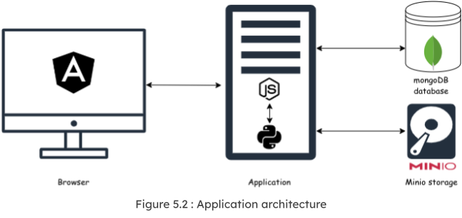
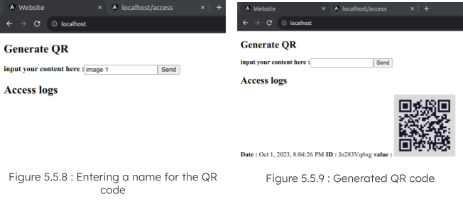

# About the internship program
This internship took the form of a structured training program.  
Throughout the internship, I worked on a 3-tier QR Code generator application.

The program consisted of the following: 
- **Debugging and Local Deployment:**  
Debugging and deploying the legacy application on a local machine after resolving identified issues in the source code.
- **Containerization and orchestration with Docker Compose:**  Containerizing the legacy application and deploying it in a pre-production environment using Docker Compose. 
- **Orchestration with Kubernetes (k3d):** Orchestracting containers using kubernetes (k3d distribution)  
- **Helm Chart Development:**  Creating Helm chart for managing Kubernetes manifests
- **CI/CD Pipeline Implementation**  Automating code integration and delivery via Gitlab CI/CD pipelines

## Credits and Thanks : 
On this occasion, I would like to express my gratitude to [Comwork](https://www.comwork.io/) for hosting me during my internship. I am particularly thankful to CEO [Idriss Neuman](https://github.com/idrissneumann) for imparting invaluable knowledge in the tech field. Additionally, I extend my appreciation to [Youssef Dhraief](https://github.com/piximos) for developing this enriching and instructive program.

## Program instructions and tasks: 
Check the program instructions from here : [workshop-instructions.md](workshop-instructions.md) 
You find all the task in the [exercices](./exercices/) folder  
## Final delivrable: 
My final deliverable conists of the:
-  [applications](./applications/) folder containing :
    - Application source code
    - Docker files and docker compose scripts  
    - Kubernetes manifests and Helm chart
    - Some shell scripts 
    
- ./gitlab folder containing :
    - .gitlab-ci.yml workflow
    - Shell scripts exectud by the workflow

# Application overview: 
## Archiecture: 

Here is a brief description of the application stack :
- Application : NodeJS + Python : creates QR codes from a string input
- Frontend : Angular : Web interface where i give string inputs and see the displayed QR outputs.
- Database : mongoDB : stores QR-related information
- Storage: Minio storage : stores QR images

## Demo: 
